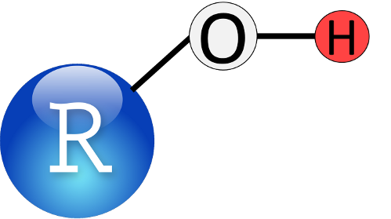

```{r, child="_styles.Rmd"}
```

<br>

### <b> Introductory R </b>



### Introduction
Welcome to programming in R. This module will serve as a tutorial to help you get aquainted with the R programming environment, and get you started with some basic tools and information that will help you along your way. Like any language, the learning curve for R is steep (like a cliff, not a hill), but once you get the hang of it you can learn a lot really quickly. Cheat sheets like this one (or [these](https://www.rstudio.com/resources/cheatsheets/) ones) can help you along the way by serving as miniature reference manuals.

<br>

### Programming conventions
There are a lot of different ways to write computer code. Each has pros and cons and ALL of them are intended to increase efficiency and readability. For example, you'll notice that none of my code goes beyond a certain vertical line in the editor. That is to make it so that people don't have to scroll over to the right of the editor to see what I have written when I hand off my code. There is no "right" way to edit your code, but it will make your life easier if you find a style you like and stick to those conventions.

> __First__, We can comment code to help us out.

```{r}
# This is a comment. 
# We know because it is preceded 
# by a hashtag, or 'octothorpe'
```

There are different ways to comment code in different languages. We use comments to make clear what we have done by leaving a written record behind.

> __Second__, There are a few ways to run a line of code:

1. Go the front of a line and press ctrl + Enter
     
2. Highlight a chunk of code and press one of the above combinations

3. Either 1 or 2, but press the 'Run' button at the top of this source
   file to run the code block.
   
4. Once you've run a code block you can change it and then press the
   button next to 'Run' (or ctrl+shift+p)  to 're-run' the previous
   block of code

<br>

> Section breaks help organization

I like to use the built-in heading. It works really well for code-folding in R and when I've written a script that is several hundred lines long, some times all I want to see are the section headings. Go ahead and type the code below into a source file. Press the upside-down triangle to the right of the line number to see what it does.

```{r}

# Section heading -----
# Follow a comment with five dashes to insert a section heading

```

<br>

### Stricter R programming rules:
All code is in R is case sensitive
```{r}
# Example (run the following lines):
  a = 1
  A = 2
  a == A
```      

<br>

A few things going on here.

1. We've defined a couple of variables for the first time. A lot of folks insist that you should use ```<-``` instead of ```=``` when you define variables (and they are probably correct), but for our purposes it will make absolutely no difference, and ```=``` is much faster to type than ```<-```.

2. Note that the two objects are not the same, and R knows this.

3. The ```==``` that we typed is a logical test that checks to see if the two objects are identical. If they were, then it would have returned a ```TRUE``` instead of ```FALSE```. This 'operator' is very useful, and is common in a number of languages.

<br>

You can't start an object name with a number, but you can end it with one.
```{r, eval=FALSE}  
# In Rstudio there are nifty little markers to show this is broken
  1a = 1 
# This one works (try it by typing 'a1' in the console)
  a1 = 1 
```

<br>

R will overwrite objects sequentially, so don't name two things the same, unless you don't need the first.
```{r}
  a = 1
  a = 2
  a         # a takes on the second value here
  print(a)  # This is another way to look at the value of an object
  show(a)   # And, here is one more
```

<br>

Some things can be expressed in multiple ways. Both 'T' and 'TRUE' can be used to indicate a logical that evaluates as being TRUE
```{r}
  T == TRUE
```

<br>

Some names are reserved or pre-defined. Did you notice that R already knew what T and TRUE were? We will talk more about this later in the course if we need to.

For example
```{r, eval=FALSE}
  in, if, else, for, function()
```
...and a mess of others have special uses

<br>

Some *symbols* are also reserved for special use, like:
```{r, eval=FALSE}
*, % %, &, /, <, (, {, [, '', "", ...
```
...and a bunch of others. A lot of these are really useful.

<br>


### Some other handy coding tricks

The 'home' button will move you to the start of the line of code, and to the start of the line if you press it twice.

The 'end' button on your keyboard will take you to the end of a line so you can edit code. These will help you move around your code faster.

The 'tab' button on your keyboard will move the code to the right some number of spaces (user defined). Pressing SHIFT + Tab will move code to the left. These can help you organize your code.

Single click moves the cursor into position. Double click will highlight the word you are clicking, and a triple left click will highlight an entire line.

Use search and replace functionality to copy big chunks of code and change names as needed. Can also use this to just search your code. PRESS CTRL + F to open the sub menu at the top.


<br>

## Data structures
### Vectors
The first thing you need to know about R is that it's a statistical programming language. It was designed by stats programmers to be used by stats practitioners. It is not a mathematical language, although it has a lot of math functionality. R is what is known as a "high-level" or "interpreted" programming language. This means the pieces that make it up are a little more intuitive to the average user than most low-level languages like C or C++. The back-end of R is, in fact, a collection of C, C++, Fortran, etc. code that builds up the functionality that we need. This means that R has a broad range of uses, from data management to math, and even GIS and data visualization tools, all of which are conveniently wrapped in an "intuitive", "user-friendly" language. Translation: you can do a lot pretty easily.

The second thing you need to know about R is that it's a "vectorized" language Why do you care about that? This will help you wrap your head around how objects are created and stored in R, which will help you understand how to make, access, modify, and combine the data that you will need for any approach to data analysis.

Let's take a look at how this works and why it matters
```{r}
  a = 1
  # Here, we have defined 'a' as a variable with the value of 1...or have we?
  a
```  

What is the square bracket here? It's an index. The index is telling us that the first element of 'a' is 1. This means that 'a' is actually a "Vector", not a "Scalar". You can think of a vector as a column in an excel spreadsheet or an analagous data table.

So, even if we define something with a singular value, it is still just a vector with one element (or row if that's easier).

This is important because of the way that it lets us do math. Even though it is a little difficult to wrap your head around now, it will help us out a lot in the future, and it makes vector operations so easy that we don't even need to think about them when we start to make statistical models. In terms of programming, it can make a lot of things more intuitive than low-level languages, too.

The vector is the basic building block of life in R. Everything else is either made of vectors, or can be contained within one. Let's play with some:

'ATOMIC VECTORS' can hold one kind of data:

Character
Numeric
Integer
Logical
Factor
Date/time

Below are some examples of ```atomic vectors```. Run the code to see what it does:


<br>

#### Integers and numerics
```{r}    
    a = c(1, 2, 3, 4, 5) # Make a vector of integers 1 through five
    print(a) # One way to look at our vector
    show(a)  # Another way to look at it
    a        # A third way to look at it
    str(a)   # We can look at the structure of our vector, integer class
```    
    
> Think:  what is an integer? This will be important down the road when we start to look at discrete vs. continuous probability distributions.

```{r}
    a = seq(1:5) # Another way to make the same vector
    a            # Print the vector to the console
    str(a)       # Look at the data structure
    a = seq(from=8, to=13, by=1) # This is the long-hand; easier to understand
    str(a)       # Notice when we make the vector this way it is 'numeric'
```

> Again, think:  what is the difference between numeric and integer? What is the difference between discrete and continuous scales of measurement?
 
<br>
   
#### Characters and factors
__Characters__ are anything that is represented as text strings.
```{r}    
    b = c('a', 'b', 'c', 'd', 'e') # Make a character vector
    b                              # Print it to the console
    str(b)                         # Now it's a character vector
    b = as.factor(b)               # But we can change that if we want
    b                              # What does that mean???
    str(b)                         # Look at the data structure for more info
```

__Factors__ are a special kind of data type in R that we may run across from time to time. They have 'levels' that can be ordered numerically. This is not really important except that it becomes really useful for coding variables used in matrices for statistical models- R does most of this behind the scenes and we won't have to worry about it for the most part. In fact, in a lot of cases we will want to change factor vectors to character class so they are easier to manipulate.

```{r, eval=FALSE}
  as.numeric(b) # This is what it looks like when we code a factor as number
  ?as.numeric   # BTW: we can ask R what functions mean like this...
                # And not just functions: we can ask it about pretty much
                # any built-in object. REMEMBER THIS.
```

<br>

#### Logical vectors
```{r, message=FALSE, warning=FALSE}
    c <-  a == b   # Most of our logicals will be yes/no or comparisons
    c            # The '==' compares our numeric vector to the factor one
    str(c)       # We now have a logical vector
    is.na(a)     # We can check for missing values
    is.finite(a) # We can make sure that all values are finite
    !is.na(a)    # The exclamation point means 'not'
    a == 3       # We can see if specific elements meet a criterion
    unique(b)    # We can just look at uniue values
```

Vectors only hold one data type
```{r}
    d = c(1, 'a', 2) # 
```

If we try this it converts everything to the lowest common denominator. In this case, we can coerce numbers to characters, but there is no way to turn 'a' into an integer or numeric class meaningfully...

#### Vector operations
We can reference specific elements of vectors
```{r}
    a[3] # Here, we are printing the third element of 'a'
    b[b=='c'] # Here, we say, print any element of 'b' that is equal to 'c'
    which(b=='c') # Or, we can ask which elements equal 'c'
```

We can do elementwise operations...
```{r}
    a * .5   # Multiplication
    a + 100  # Addition
    a - 3    # Subtraction
    a / 2    # Division
    a ^ 2    # Exponentiation
    exp(a)   # This is the same as 'e to the...'
    log(a)   # Natural logarithm
    log10(a) # Log base 10

    b = as.character(b)
    paste(b, 'AAAA', sep='') # We can append text
    paste('AAAA', b, sep='') # We can do it the other way
    paste('AAAA', b, sep='--') # Add symbols to separate
    gsub(pattern='c', replacement='AAAA', b) # We can replace text

    e = paste('AAAA', b, sep='') # Make a new object
    e                            # Print to console
    substr(e, start=5, stop=5)   # We can strip text (or dates, or times, etc.)
```

We can check how many elements they have...
```{r}
    length(a) # A has a length of 5, try it and check it
    a         # Yup, looks about right
```

<br>

### Matrices
Matrices are made up of vectors
```{r}
# We can make matrices by binding vectors that already exist
  cbind(a,e)
# Or we can make an empty one to fill
  matrix(0, nrow=3, ncol=4)
# Or we can make one from scratch
  mat = matrix(seq(1, 12), ncol=3, nrow=4)
# We can do all of the things we did with vectors to matrices, but now we
# have more than one column, and official 'rows'
  ncol(mat)   # Number of columns
  nrow(mat)   # Number of rows
  length(mat) # Total number of entries
  mat[2, 3]   # Value of row 2, column 3
  str(mat)    # See how no. of rows and columns is defined in data structure?
# With rows and columns, we can assign column names and row names. Honestly,
# we will almost never use these but you may come across it elsewhere
  colnames(mat) = c('first', 'second', 'third')
  rownames(mat) = c('This', 'is', 'a', 'matrix')
  mat
  str(mat) # Take a look at the data structure and see if you understand
  mat*2 # All the same operations we did on vectors above...one example
```

<br>

More on matrices as we need them. We won't use these a lot in this course, but R relies heavily on matrices to do linear algebra behind the scene in the models that we will be working with.

<br>

### Dataframes
Data frames are like matrices, only not. They have a row/column structure like matrices. But, they can hold more than one data type!

Data frames are made up of 'ATOMIC VECTORS'

This, and the atomic vector, is probably the data structure that we will use most in this course.

Let's make a dataframe:
```{r}
  a = seq(from=.5, to=10, by = .5)  # Make a sequence
  b = a^2                           # Vector math- raise each 'a' to power of 2
  c = rep(c('a','b','c','d'), 5)    # Replicates values in object a # of times
  d = data.frame(a, b, c)           # Note, we don't use quotes for objects
```

<br>

Now we can look at it:
```{r}
  d # Print the dataframe
```

<br>

Notice that R assigns names to dataframes on the fly based on object names. They are not ```colnames``` as with matrices, they are ```names```.
```{r}
  # We can look at these
    names(d)     # All of the names
    names(d)[2]  # One at a time: note indexing, names(d) is a vector!!
  # We can change the names
    names(d) = c('Increment', 'Squared', 'Class') # All at once- note quotes
    names(d)               # Print it to see what this does
    names(d)[3] = 'Letter' # Or, one at a time..
    names(d)               # Print it again to see what changed
    e = d                  # We can also rename the entire dataframe
    head(e)                # This will show us the first six rows of a dataframe
    head(e, 10)            # Or, we can look at any other number that we want
    e$Sqrt = sqrt(e$Increment)
    e # We can make new columns in data frames really easily like this!
```

<br>

Looking at specific elements of a dataframe is similar to a matrix, with some added capabilities. We'll do this with some real data so it's more fun. Most of the packages in R have built in data sets that we can use for examples. Let's start by looking at the Iris data.
```{r}
    data('iris')  # This is how you load built-in data sets
    ls()          # We can use ls() to see what is in our environment
    head(iris)    # Look at the first six rows of data in the object
    nrow(iris)    # How many rows does it have?
    ncol(iris)    # How many columns?
    names(iris)   # What are the column names?
    str(iris)     # Have a look at the data structure- tells us all of the above
    summary(iris) # Summarize the variables in the dataframe

  # Now let's look at some specific things
    # What is the value in 12th row of the 4th column of iris?
      iris[12, 4]
    # What is the mean sepal length among all species in iris?
      mean(iris$Sepal.Length)
    # What about the mean sepal length just for setosa?
      # A couple of new things going on here:
      # 1. We can refer to the columns as atomic vectors within the dataframe if
      #    we want to. Some times we have to do this...
      # 2. Note the logical check for species
      # 3. What we are saying here is:
      #    "Show me the mean of the column Sepal.Length in the dataframe iris
      #    where the species name is setosa"
        mean(iris$Sepal.Length[iris$Species=='setosa'])
      # We can write this out longhand to make sure it's correct (it is)
        logicalCheck = iris$Species == 'setosa'
        lengthCheck = iris$Sepal.Length[iris$Species=='setosa']
      # We can also look at the whole dataframe just for setosa
        setosaData = iris[iris$Species=='setosa' , ]
        # Note that the structure of species is preserved as a factor with three
        # levels even though setosa is the only species name in the new df
          str(setosaData)

      # Some quick plotting code
      # Once we have a nice dataframe like these ones, we can actually step into
      # The world of exploratory analyses.
        hist(setosaData$Sepal.Length) # Make a histogram of sepal lengths
        plot(setosaData$Sepal.Width, setosaData$Sepal.Length) # Bi-plot
        boxplot(Sepal.Width~Species, data=iris) # Boxplots
```

<br>

### Lists
Lists are the ultimate data type in R. They are actually a vector that can hold different classes of data. Each element of a list can be any kind of object (an atomic vector, a matrix, a dataframe, or even another list!!).

The real, filthy R programming relies heavily on lists. We will have to work with them at some point in this class, but we won't take a ton of time on them here.

Let's make a list- just to see how they work
```{r}
  myList = vector(mode='list', length=4)
  myList[[1]] = a
  myList[[2]] = c
  myList[[3]] = mat
  myList[[4]] = d

# Print it
  myList                                   # Cool, huh?
  names(myList)                            # No names on the fly like a df
  names(myList) = c('a', 'c', 'mat', 'd')  # Give it names like a dataframe
  myList                                   # See how the names work now?
  myList[[1]]                              # We reference these differently [[]]
  myList[[2]][5]                           # But can still get into each object
  # Play around with the numbers to see what they do!
  myList$c[1]                              # Can also reference it this way!
```

Very commonly, model objects and output are stored as lists. In fact, most objects that require a large amount of diverse information in R pack it all together in one place using lists, that way we always know where to find it. It seems like a lot to take in now, but will be very useful in the future.