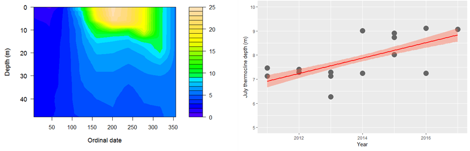

```{r, child="_styles.Rmd"}
```

<br>
 
### <b> Introduction to R for Aquatic Research </b>

#### 2018 NALMS International Symposium 



Welcome to the home page for the <b> Introduction to R for Aquatic Research Workshop </b> at the 2018 International NALMS Symposium. 

<br>
This workshop will consist of two sessions. The <a href="morning.html"> morning session </a> (8:00 am - 12:00 pm) will be an introduction to <a href=https://www.r-project.org/> R </a> as a functional, vectorized, and object-oriented statistical programming language. It will cover R syntax (e.g., how to read and write R code), types of variables and objects, functions, data management (e.g., loading, referencing, manipulation, transformation, and subsets), basic descriptive statistics, and working with R packages. The <a href="afternoon.html"> afternoon session </a> (1:00 - 5:00 pm) will build on these techniques using the <a href=http://www.secchidipin.org/> Secchi Dip-In </a> data and other data sets for an Intermediate R Workshop. Topics will include regression analyses, predictions, simulation, and data visualization. Those less familiar with R should plan on attending both sessions, but those who have some experience using R could consider skipping the morning session and join during lunch for a half-day session. Laptop computers are required for both sessions. <b> All software is freely available </b> and instructions for installation will be distributed prior to the workshop.

<br>
 
