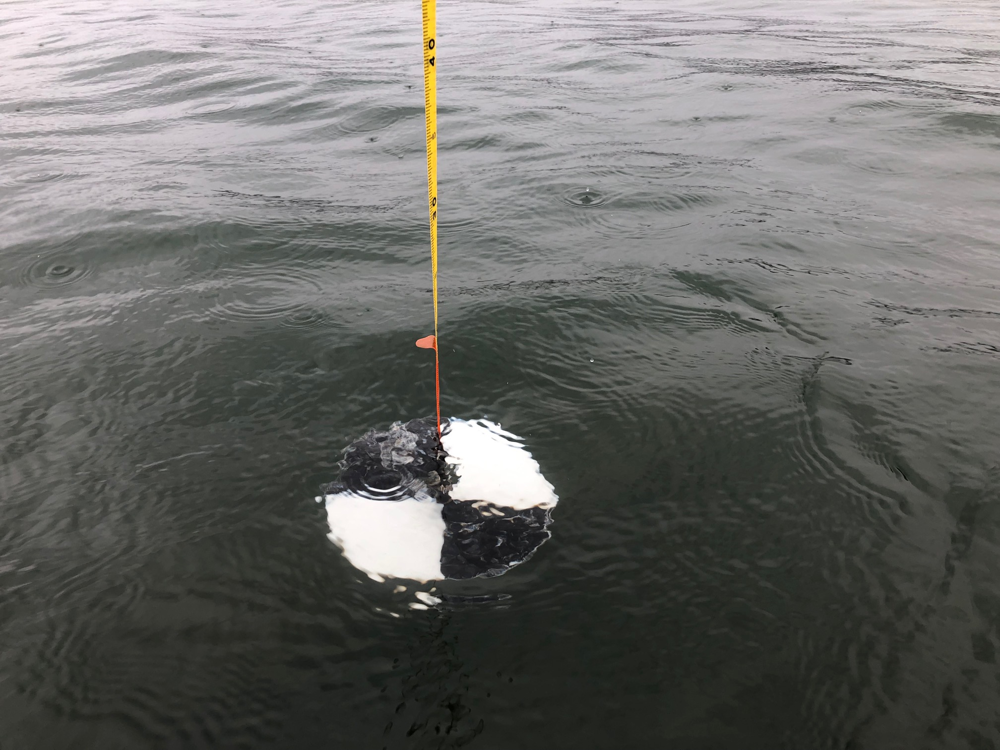

```{r, child="_styles.Rmd"}
```

---
title: Intermediate R
---



<h2 top-margin:10px;><b> Introduction </b></h2> 

As folks learned in the Introductory session, once we have a basic grasp on how R works, and how and where to find help, the learning process becomes a lot less painful, and we can start to build an appreciation for how convenient it is to have a script we can come back to again and again. To show off this convenience, and the power of R as a statistics program, we will spend the afternoon session walking through some applied analyses and data visualization tools.

The plan for the Intermediate session is to work through two a combination of long-term and seasonal examples of common analyses in lake management. We will start with the Otsego Lake data from the Introductory session and do some data manipulation, statistical analyses, and visualization of long-term changes in a single lake. We'll then look at how this can be applied to many lakes at once using the same tools. Finally, we'll wrap things up by investigating seasonal changes in the Otsego Lake water column throughout the year by making some isopleths.

We will work with functions from a bunch of packages within the `tidyverse` for this session. You can go ahead and load that now. We will load a few others as we go along in this module, and during the workshop.

```{r, warning = FALSE, message= FALSE}
library(tidyverse)

```


## **Data overview and management**
Before we ever get into a statistical analysis, it is always good practice to have a good, long look at the data we are working with to make sure everything makes sense, and to note issues that may rear their heads down the road. Let's start by reading in the Otsego Lake data and getting reacquainted. This data set is part of a long-term monitoring data set collected by the SUNY Oneonta Biological Field Station at Otsego Lake in Cooperstown, NY. We read the data in with the argument `stringsAsFactors = FALSE` because there are a lot of string variables in the data, and factors can add extra handling time to our workflow (see <a href="introductory.html"> Introductory session tutorial </a>).

```{r}
otsego <- read.csv("data/physical.csv", stringsAsFactors = FALSE)

```

So, what are we working with here? Let's have a look. Remember from the Introductory session that it might be useful to understand how R sees your data first and foremost. The most reliable method for doing this with dataframes is to look at the **structure** of your data using `str()` or the `glimpse()` function from the `tidyverse`.
```{r, eval=TRUE}
# Like this:
glimpse(otsego)

```

Now that we have an idea of what the data set looks like, let's take a little closer look. First, there are a couple of things that we can do that will clean up our code down the road a little bit. Let's have a quick look at our column names again.

```{r}
names(otsego)

```

Most of these are nice and clean, but there are some things that happen when we read data into R from Excel files (like replacing special characters with `...`). Plus, the less we have to change when it comes time to plot the better off we'll be.

We are not going to replace all of the names, because we are not going to work with all of the columns, but let's replace a couple of these that we are definitely going to use (if only to show how this works). For now, let's just change the name for `temp` so that it is easier to recognize as temperature.

Remember that the result of `names(otsego)` is a vector, and we can replace individual elements of that vector. We just need to know the index of the element we wish to replace. In this case, `temp` is the 3rd column of the dataframe `otsego`. 

Here is how it works:

```{r}
# First, we replace temp with Temperature
names(otsego)[5] <- "Temperature"
```

Have a quick look to make sure you are happy with the new names.
```{r}
# Print the names of the df
# to the console so we can
# see them.
names(otsego)
```

## **Data manipulation**
Now that we have had a quick look at our data, and we have made some changes for the sake of convenience, let's dig a little deeper. This afternoon, we are going to use `Temperature` as our **response**, or **dependent variable** to demonstrate some basic statistical techniques in R. Before we can do any actual statistics, though, it is good practice to scrutinize the data we intend to use.

First, we'll need to go ahead and do some work to get variables like `month` and `year` out of our `date` column. To do this, we'll use functions from the `lubridate` package. 

```{r}
library(lubridate)

# Get date in a standard, unambiguous format
otsego$date <- as.Date(otsego$date, format = "%m/%d/%Y")

# Make a variable to hold year in the df
otsego$year <- year(otsego$date)

# Convert month to a factor so it can be easily re-leveled and ordered
otsego$month <- month.abb[otsego$month]
otsego$month <- factor(otsego$month, levels = month.abb)

# Let's make an ordinal date variable to get day of year as well
otsego$doy <- yday(otsego$date)

```


### **Data exploration**
Now that we at least have a handle on where our data come from, we can start to poke around a bit more. 

To start with, let's take a quick look at `Temperature` in our original `otsego` dataset using a histogram. If we were going to do some statistical analyses, this would be our response of interest in the data set!

```{r}
ggplot(otsego, aes(x = Temperature)) +
  geom_histogram(bins = 30)
```
 
From this plot alone, there are a few things that should be obvious. 

First, we can see that the distribution of our response is **right-skewed**, with many more observations between 4 and 10 degrees Celsius than at the extremes. This should make intuitive sense based on the depth of the lake (about 50 m) and the fact that this lake is temperately located.

Second, perhaps more nuanced, is that there are a few zero values and even a couple of negatives. Since we know that fresh water freezes at zero degrees, then we can probably afford to get rid of these for our purposes. If we had the ability, however, we would want to confirm that this was appropriate to do.

We will need to think about both of these characteristics as we move into statistical analyses. One of the central assumptions of modern regression tools relates to normality of residuals, which in the absence of heterogeneous groups, can initially be approximated using a histogram of the response. And, transformations that we might wish to use to achieve normality can be sensitive to the presence of zeroes or negative values.

## **Data transformations**
We can handle both of these problems by log-transforming our response variable like this:

```{r}
otsego$log_temperature <- log(otsego$Temperature)
```

We can plot histogram of the residuals again to see what it did:

```{r}
ggplot(otsego, aes(x = log_temperature)) +
  geom_histogram(bins = 30)
```

Our residuals look more like a normal distribution now, although there is still some skew. Now it is just going in the other direction [eye roll]. 

As you can see, our response variable is no longer constrained to be greater than zero on the log scale, so we don't have to worry about getting  negative predictions from any of the statistical models that we make now either. We'll just have to deal with that on the back end.

You should also notice that in both cases now, you've gotten warnings to let you know that we have some missing or non-finite values. We'll be sure to remove these prior to any analyses to make our lives easier down the road. Let's filter the data set to get only those observations with non-zero temperatures to make our lives a little easier:

```{r}
otsego <- otsego %>% 
  filter(!is.na(Temperature) & Temperature > 0)
```

Now we can move forward with some statistics!

## **Introductory statistics in R**
Let's start with the simple case of comparing `Temperature` between the epilimnion and hypolimnion of the lake. If you have a basic understanding of statistics, you might immediately realize that this is a comparison of a continuous variable between two groups. We have a couple of paths forward here. We could either set aside distributional assumptions and use **non-parametric** methods, or we could assume some distribution for our error structure and proceed using **parametric** or **semi-parametric** statistics. Please note that these assumptions should not necessarily be based on the histogram of the data that we created above.

In either case, we are going to have to make sure we assign each observation to either the epilimnion or hypolimnion before we can start.

To do this, we'll create a new variable in the data set.

```{r}
otsego$layer <- "epilimnion"
otsego$layer[otsego$depth > 15] <- "hypolimnion" 
```

### **Wilcoxon rank-sums test**
Let's start by fitting a quick Wilcoxon rank-sums test (aka Mann-Whitney U-test). While our options for non-parametric statistics are limited in complexity, they do not require distributional assumptions, and they tend to be more **conservative** than parametric tests, especially under limited sample sizes (not the case here).

Here is how we do it:
```{r}
# Wilcox test to assess the null hypothesis
# that there is no difference in temperature between
# epilimnion and hypolimnion.
wilcox.test(Temperature ~ layer, data = otsego)
```

Okay, if you have never done a Wilcox test by hand, or even in Excel, please appreciate how **ridiculously easy** this is. But, more importantly, what is going in the output here?

We can see that we have conducted a Wilcoxon rank sum test. Second, R gives us a friendly reminder of what our data were that went into this. Next, we have the actual statistics for the test, including the test statistic `W` and the `p-value` for the comparison. With the handy-dandy `alternative hypothesis` that R provides us, we can conclude that since p < 0.05 we reject the null hypothesis that there is no difference between groups.

While this is useful for making inference, we don't get a good sense of how the group means actually differed from this test (although we could graph it). For that, we need to start making some assumptions about our data and the shape of the error associated with those data.


### **Parametric statistics in R**
Parametric statistics rely on some basic **assumptions** about or data and the error structure around our observations. There are a number of fundamental assumptions that guide our forays into what is essentially "the rest of statistics". How we deal with these assumptions can range from doing nothing, to data transformation, to use of alternative model structures that allow us to shift or relax them.

What are these assumptions? Glad you ask!


### **Assumptions of linear models**
Linear models you say? Yes. While we don't have time to go in the ugly math behind this (ahem, **the beautiful, unifying math** behind this), suffice to say that most of the statistics we use in aquatic research are special cases, or generalizations, of the linear model. This includes things like t-tests, linear regression, ANOVA, ANCOVA, GLM, GLMM, GLS, GEE, and even multivariate statistics. The same holds true whether we are working with classical frequentist tools relying on least-squares estimation and maximum likelihood, or Bayesian methods using MCMC estimation. That means we always need to have these assumptions in mind.

Briefly, these assumptions include:

  **1.** Independence of observations.

  **2.** Normality of residuals (with mean=0).

  **3.** Homogeneity of variances (i.e. homoscedasticity).

We will discuss quickly in the afternoon session, but a more detailed explanation of each can be found <a href="assumptions.html"> here </a>. This is definitely something you should be comfortable with before getting crazy with the stats.

### **The t-test**
The t-test is our go-to tool for comparing two group means with parametric statistics. Even when we use analysis of variance (ANOVA) to test for differences in means between more than two groups, we still need to use t-tests to follow up and determine pair-wise differences (usually using a Tukey HSD or analagous test to control family-wise error rates).

Using a t-test in R is pretty straightforward. For this example, we will use a t-test to test the null hypothesis that there is no difference in `Secchi` between `Lake` and `Reservoir` classes. To do this, we use the function `t.test()`.
```{r}
# T-test to assess the null hypothesis
# that there is no difference in temperature
# between the epilimnion and hypolimnion in Otsego Lake.

# We use log_temperature to meet assumptions
# of normality.

# We can specify this one using a formula.
# To be conservative here, we will assume
# that we have unequal variances using
# one of the optional arguments. Note that
# the default in R is to assume that variances
# are not equal, and this defaults to
# a Welch's t-test that uses a calculated df
# to adjust the calculated test statistic.
t.test(log_temperature ~ layer, data = otsego, equal = FALSE)
```

```{r, echo = FALSE, results='hide', eval=TRUE}
mod <- t.test(log_temperature ~ layer, data = otsego, equal = FALSE)
```


Yay, more output!

Similar to the `wilcox.test`, the output of our `t.test` gives us the test that was used, the data provided to the function, the test statistics (now with `df`), and the `alternative hypothesis` to be accepted if p < 0.05. But, in contrast to the Wilcox, we have a little more information to go on.

This time, we get an actual confidence interval our estimate of the difference between groups. Here, we see that we are 95% confident that the true difference in `Temperature` between `epilimnion` and `hypolimnion` is between `r round(mod$conf.int[1], 2)` and `r round(mod$conf.int[2], 2)`. Note that this difference is positive because of the alphabetical ordering of the layers. If we had reversed this, our 95% confidence interval on the estimated difference would have used negative values. In either case, we can now say that the epilimnion is warmer than the hypolimnion...shocker.

R also tells us that the mean of `log_temperature` is `r round(mod$estimate[1], 2)` for `epilimnion` and `r round(mod$estimate[2], 2)` for `hypolimnion`. We can bring these back to the real scale using the function `exp` to say that the mean of `Temperature` is `r round(exp(mod$estimate[1]), 2)` for `epilimnion` and `r round(exp(mod$estimate[2]), 2)` for `hypolimnion`. 

We could go about showing these differences graphically using (for example) a violin plot. 

```{r}
ggplot(data = otsego,
       aes(x = layer, y = log_temperature, color = layer, fill = layer)) +
  geom_violin(alpha = 0.10, draw_quantiles = 0.50)
```

This plot shows us that there is clearly a lot more variability in epilimnetic temperatures, as well! This is because we haven't begun to touch seasonal or long-term differences. We could start to tease apart seasonal differences with another test from this same family.


### **Analysis of variance**
It is only a small step to move from a t-test to analysis of variance (ANOVA) conceptually, and this also requires only a small change to code in R. In theory, ANOVA is usually used to compare means of a continuous response when we have three or more groups. In practice, it is mathematically equivelant to a t-test if we have only two groups (the F-statistic is, in fact, just the sqaure of the t-statistic).

To demonstrate this, and to keep ourselves from being swept afield with another data set, let's demonstrate ANOVA by investigating seasonal changes in lake-wide temperature.

It can be more convenient to store the results of ANOVA in an object than just dumping the output to the console, so let's start there. First, we will fit our ANOVA with the `lm` function (stands for linear model) because this is the most general tool for us.

```{r}
# Fit an ANOVA to test for differences in
# means between groups
mod <- lm(log(Temperature) ~ month, data = otsego)
```

Now, before we get into looking at p-values here, it is **important** that **we diagnose the model first**. But, we've only got a few hours to get through this so we'll skip it until the end of this analysis. I'm trying to tell a story for now, bear with me.

We can make an ANOVA summary table in R using the lowercase `anova` function to get overall factor significance.

```{r}
# Get ANOVA summary for the model
anova(mod)
```

Here, we can see that our factor `month` had a significant effect on `Temperature`, and we can reject the null hypothesis that there is no difference between any of the group means.

From there, we can go on to make group-specific boxplots of the response to make the difference clearer for the reader.

```{r}
ggplot(otsego, aes(x = month, y = Temperature)) +
  geom_boxplot()
```

### **Linear Regression**
Non-parametric statistics, t-tests, and ANOVAs are great for testing hypotheses about differences between groups, but they don't really allow us to examine changes that occur along continual gradients. In our fields, those kinds of changes are often the things in which we are actually interested. For example, we may wish to understand how temperature or Secchi depth change with year to quantify long-term trends. To do this, we will rely on linear regression.

Linear regression takes the familiar form of the equation for a line:

$y = mx + b$

Where $y$ is the dependent variable, $b$ is the y-intercept, $m$ is the slope of the line, and $X$ is the independent variable.

In statistics, we write this as

$y_{i} = \beta_{0} + \beta_{j} \cdot X_{j,i} + \epsilon_{i}$

Where $y_{i}$ is the *i*^th^ value of the dependent variable, $\beta_{0}$ is the y-intercept, $\beta_{j}$ is the slope of the line, $X_{j,i}$ is an independent variable, and $\epsilon_{i}$ is our error (assumed to have a mean of zero so it can be dropped- that's why it is important to check).

More generally, we could extend this to have an arbitrarily large number of slopes and independent variables (i.e., multiple regression):

$y_{i} = \beta_{0} + \sum_{\substack{j=0}}^k (\beta_{j} \cdot X_{j,i}, ..., \beta_{k} \cdot X_{k,i}) + \epsilon_{i}$

What fun!

How about fitting this kind of model in R? It will take us less time than it did to write out the equations. 

Here, we will fit a linear regression to test the effects of `year` on `Temperature`. To do this, we can stick with the `lm()` function. 

Next, we will fit the model using the same `lm()` function that we used for ANOVA above. The reason we can do this is that ANOVA, t-tests, and linear regressions are all just specific cases of the linear model.

We will fit a model testing the effect of `year` on `Temperature`. 

```{r}
# Fit the model
lmod <- lm(log(Temperature) ~ year, data = otsego)
```


We can get the regression coefficients for our model directly from a summary of a fitted model object.
```{r}
summary(lmod)
```

Here, `(Intercept)` is the y-intercept for our model, and ``r names(lmod$coefficients)[2]`` is our "slope". In this case, we see that our y-intercept is significantly different from zero (p = `r format(summary(lmod)$coefficients[,4][1], digits=2)`), and we detected a significant effect of `Latitude` on `logSecchi` (p = `r format(summary(lmod)$coefficients[,4][2], digits=2)`). The interpretation of the latter is that the slope is not equal to zero. 

Looking a little closer at the output, we can also see that we have only explained about 0.2% of the variability in `Temperature` using `year` as the only explanatory variable (R^2^ = `r round(summary(lmod)$r.squared, 3)`). But, let's plot the result anyway.

In order to plot the result of our model, we need to make some predictions from it first. This is super easy to do in R. You'll get a warning that you are making predictions from the observed data even though this is supposed to be fore future predictions on new data - fine for now, can talk about that one when we have more time!

```{r, warning = FALSE, message = FALSE}
log_preds <- predict(lmod, interval = "prediction")
```

We just need to undo our log transformation once we have our predictions so we can plot them:

```{r}
# Convert back to real scale
real_preds <- apply(X = log_preds, MARGIN = 2, FUN = exp)
```

Let's have a look at what our predictions look like:
```{r}
# Take a look at the first few
# rows of the preds dataframe
head(real_preds)
```

Now we can smash them back together with the raw data:

```{r}
otsego_preds <- data.frame(otsego, real_preds)
```


```{r}
ggplot(otsego_preds, aes(x = year, y = Temperature)) +
  geom_point(alpha = 0.10) +
  geom_line(aes(y = fit), size = 1, color = "black") +
  geom_ribbon(aes(ymin = lwr, ymax = upr),
    color = "black",
    fill = "gray87",
    alpha = .5,
    lty = 2,
    lwd = .5
  ) +
  theme(legend.position = "none")
```

Wow, this graph is almost as underwhelming as the R^2^ for the model that was used to create it. If we had just reported p-values, this would have gone un-noticed and someone might have misused the result. The graph and the R^2^ tell us that our model, while statistically significant, doesn't do a great job capturing the trends in our data. You can even see in this graph that we are uncertain about the actual slope of the line by looking at the lower, mean, and upper prediction intervals. If you have been paying attention, or if you spend much time on glacial lakes above latitude 42 N, then you know that this is because 1) there is a ton of seasonal variability that we haven't captured in this regression and 2) we are looking at depths throughout the lake, which are not likely to change in temperature the same way. How to fix this?

### Analysis of covariance
Analysis of covariance (ANCOVA) is as complex as we'll get with data analysis today. And, it is a great tool for understanding effects of multiple explanatory variables as continuous responses. Without getting into the math, it can accommodate both continuous explanatory variables like `year` and categorical explanatory variables like `month` names. We'll wrap up this section by combining our other examples to simultaneously model `Temperature` as a function of `year` and `month`. This model tests the hypothesis that temperature has changed across years since the 1990s, while accounting for variation among months.

To simplify, we will work just with the top 5 meters of the water column so we don't have to argue about how best to incorporate depth in what time remains.

Filter the data to get just the first 5 meters. 

```{r}
surface <- otsego %>% 
  filter(depth <= 5)
```

Now we can fit the statistical model:

```{r}
surface_mod <- lm(log(Temperature) ~ year + month, data = surface) 
```


Typically, here we would do statistical inference next using p-values, model selection, or cross-validation. And then, finally, We can make predictions from this model the same way that we did for linear regression and ANOVA. We'll take some time to make this pretty during the workshop, of course

```{r}
# Make predictions from the model on the log scale
lpreds <- predict(surface_mod, interval = "prediction")

# Back-transform fit, lwr, upr to the real scale by exponentiating
rpreds <- apply(lpreds, 2, exp)

# Smash it together with the original data.
# Yes R, we know these are not future responses, just do it
lake_preds <- data.frame(surface, rpreds)

# Plot the predictions against the observed data
ggplot(lake_preds, aes(x = year, y = Temperature)) +
  geom_point(alpha = 0.10) +
  geom_line(aes(y = fit)) +
  geom_ribbon(aes(xmax = year, ymin = lwr, ymax = upr), alpha = 0.1) +
  facet_wrap(~month) +
  theme_bw()
```


## **Response surfaces (isopleths)**
When we have more than one continuous variable in a regression model, it can be helpful to think about **surfaces** instead of **lines**. While it sounds difficult conceptually, these are actually fairly common tools in our everyday lives. Elevation contours are one such example of a response surface (think `lm(elevation~latitude*longitude)` in the simplest sense now that you are fluent in R).

In lake management, we frequently run across these kinds of applications when we create **bathymetric maps** and **isopleths**.

Here, we will investigate some basic tools for visualizing response surfaces, and specifically, we will create some isopleths.

For this example, we will go back to the `otsego` data and start by making an isopleth of `Temperature` for a single year. In this crowd, the concept probably requires less explanation than any of the statistics we've used so far, but basically we want to come up with a 3-dimensional way to visualize changes in temperature across time (days) and space (depth).

**NOTE** that if we had just read this data set in, one of the first things that we are going to have to deal with is the formatting of dates in this data set. We have done this already.

Let's start by creating a column with inverted depths so we can plot the lake from surface to bottom and make the graph easier to read.
```{r}
# Set this aside as a new object
# We'll drop any observations that lack data
lim <- otsego %>% 
  filter(!is.na(depth) & !is.na(doy) & !is.na(Temperature))


# Multiply depth column by -1 so depth will
# plot from top to bottom.
lim$depth <- -1 * lim$depth
```

Now, we are ready to do the math behind the isopleth and plot it. To do the math, we need to load the `akima` package:
```{r, warning=FALSE, message=FALSE}
library(akima)

```

Next, we interpolate `temp` across `date` and `depth`. The interpolation we are using is basically just a bunch of linear regressions to predict `temp` for values of `date` and `temp` across a regular grid.
```{r, warning=FALSE, message = FALSE}
# Create a data frame containing the
# x, y, and z variables of interest
plotter <- data.frame(x = lim$doy, y = lim$depth, z = lim$Temperature)

# Sort it so we have ascending values of x and y
plotter <- plotter[with(plotter, order(x, y)), ]

# Make a regularly spaced x, y, z grid using
# linear interpolation from the akima package
im <- with(
  plotter,
  akima::interp(x, y, z,
    duplicate = "mean",
    nx = 360,#length(unique(lim$doy)),
    ny = 50 #length(unique(lim$depth))
  )
)
```

To wrap it all up, we can make the plot. This looks like a lot of code, but it is mostly comments.

```{r}
# Plot the isopleth
# filled.contour is the function that actually
# makes the contour plot. This is the same function
# that is used in the wtr.heat.map function in the
# RLakeAnalyzer package, but it is executed from
# within a convenience wrapper there, so it is
# hard to customize.

# I tend to work with the filled.contour
# function from the graphics package (included
# in base R and loaded by default). This is
# just a preference driven by need for
# more flexibility.

# Set up plotting window margins
par(mar = c(4, 4, 2, 8))

# Make the graph
filled.contour(
  im$x, # Variable on x-axis (date)
  im$y, # Variable on y-axis (depth)
  im$z, # Response (water quality parameter)
  # Could also choose 'grey.colors' or 'terrain.colors'.
  # If you want the ramp to go the other way,
  # just delete the 'rev'. Note that you will
  # need to change the 26 in parentheses to match
  # the number of levels that you actually have or
  # want to display.
  col = topo.colors(30),
  # I don't like in-figure titles.
  # You can add one, though. You will, however,
  # need to change the 'mar' argument in the call
  # to par above.
  main = expression(paste("Temperature (", degree, "C)")),
  # Specify y-axis limits.
  ylim = c(min(im$y), max(im$y)),
  # Specify x-axis limits. In this case, we are "zooming in" on year 2017
  # Can use this one instead if date formatting throws error
  # xlim = c(as.numeric(as.Date("2017/05/01")), max(im$x)),
  xlim = c(0, 366),
  # X-axis label
  xlab = "Day of Year",
  # Y-axis label
  ylab = "Depth (m)",
  # This next block of code controls the lines that are overlaid. The interpolation
  # is the same, so the axes and the number of levels need to be the same, too.
  plot.axes = {
    contour(
      im$x, im$y, im$z, # X, Y, Z values (same)
      nlevels = 26, # Need to change this with the No. on line 37 to be same!
      levels = seq(0, 26, 1), # Will need to change for different parameters
      drawlabels = FALSE, # Don't want R to draw the labels, they are ugly
      col = rgb(1,1,1,0),
      add = TRUE); # Add the lines to the existing plot
    # X-axis to assign month abbreviation at first ordinal day of each month
    axis(1, at = c(1, 32, 61, 92, 122, 153, 183, 214, 245, 275, 306, 336),
         labels = month.abb, cex.axis=1.10
    )
    # Y-axis
    ### Change to match range of data
    axis(side=2, at=seq(-50, 0, 5), seq(50, 0, -5), las=2, yaxt='l', cex.axis=1.1);
    # Add sampling points to x-axis
    points(unique(lim$doy), 
           rep(-50, length(unique(lim$doy))), 
           pch=21, bg=rgb(0,0,0,.05), xpd=T)
    
  })
```

One of the things we have to be careful about with these graphs is that they are models, and if we are missing data at critical time periods, then our models are only as good as our data allow. This can be seen in the plot above. There are some odd artifacts in these estimates that can show up where we are missing data or when lake surface elevation changes due to ice (in the case above) or drawdown. Likewise, this is a composite across nearly 40 years so there are few gaps from January through December, which is not usually the case. If we miss key seasonal events like mixing in spring or fall, these graphs can provide incorrect approximations of the real in-lake phenomena.

Have a go at these isopleths again, substituting DO or pH or looking at just one year at a time. You should find that the only code that needs to be changed is the variable used for `z` when you create the `plotter` data above, and the title of the plot.
