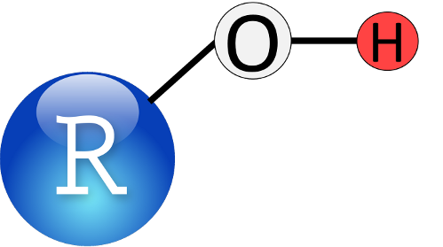

```{r, child="_styles.Rmd"}
```

---
title: "Introductory session"
---

<h3 top-margin:10px;><b>Introduction to R for aquatic research</b></h3>



The Introductory session of this workshop will provide an introduction to the basics of working in R. By the end of this session, you should be comfortable working through these and other examples on your own in the future so you can learn more about the program. During this session, you will be exposed to a broad overview of programming in R, read in data from external files, learn to work with "packages", do some basic data manipulation and summary statistics, and use data to make some basic graphs. We will also cover basic syntax and mechanics of the programming language to facilitate discussion of more advanced topics during the <a href="afternoon.html">Intermediate session</a>.

You can find the **online tutorial for the first half** of the Introductory session <a href="introductory.html"> here </a>.<br>
You can find the **online tutorial for the second half** of the Introductory session <a href="Introductory-II.html"> here </a>. <br>
The **data and code files** needed for the Introductory session are located <a href="https://github.com/danStich/data4_r4nalms"> here </a>, along with instructions for download.

For those wishing to get a head start on learning about R, the Introductory session will loosely follow along with Chapters 1 - 4 in [The Worst Stats Text eveR](https://danstich.github.io/worst-r/).

<br>
 