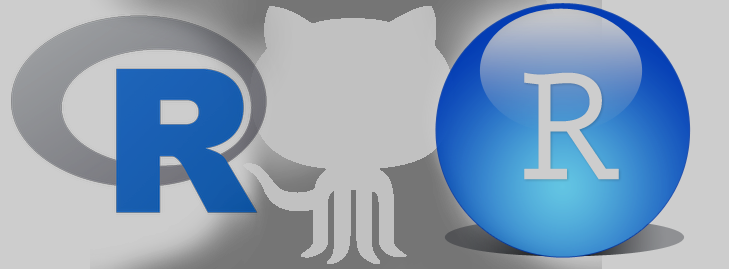

```{r, child="_styles.Rmd"}
```

---
title: Getting started
---



This page is here to get you started with software and files you'll need for the workshops. It will probably be easiest to get everything you need if you work through the steps below one at a time.

<h2 id = "multi"><b>Software needs</b></h2>

All software required for this class is <b>freely available</b> and <b>easily installed</b>. Please download and install the most recent versions of each before the workshop. Instructional videos and download links are provided below.

<h3 id = "multi"> **Download and install R** </h3>
For <a href=https://cran.r-project.org/bin/windows/base/> Windows </a> or <a href=https://cran.r-project.org/bin/macosx/> Mac </a>. You should download the most recent versions for your operating system. Accept the default options.

<h3 id = "multi"> **Download and install RStudio** </h3>
<a href=https://www.rstudio.com/products/rstudio/download/#download> Rstudio download site</a>. You should download the most recent version. This program will not work without an existing installation of R. Also accept default installation options.

<b> Video instructions for installing R and RStudio </b><br>
If you are more of a visual learner, here are a couple of YouTube videos that walk through installation on Windows and Mac OS-X. If you are using linux, you know what to do.

[3 minute YouTube video for Mac](https://www.youtube.com/watch?v=EmZqlcKkJMM)<br>
[3 minute YouTube video for Windows](https://www.youtube.com/watch?v=iLSvjyYvbpU)

<b> Video instructions for getting started with R and RStudio </b><br>
It may be helpful to watch a couple of YouTube videos before the workshop, especially if you are stuck already (no shame). There are tons of them out there, including some that walk you through how to install and open R and RStudio. This year, we are making this content available through the [R4NALMS Youtube channel](https://www.youtube.com/channel/UCcQsWXjTXYIfGTAJyxDaAyw/) to which you can subscribe.


<h2 id="multi">**Data and code files**</h2>

All data and code files needed for both sessions are located <a href="https://github.com/danStich/data4_r4nalms"> here </a>. There are instructions for downloading the workshop content as a compressed (`ZIP`) folder and extracting content in the README that should display at the bottom of the page linked.

Here is a quick demo (no sound) from the R4NALMS YouTube Channel: [Downloading R4NALMS workshop files](https://youtu.be/Gl63MHt6XeA).

<br>
 