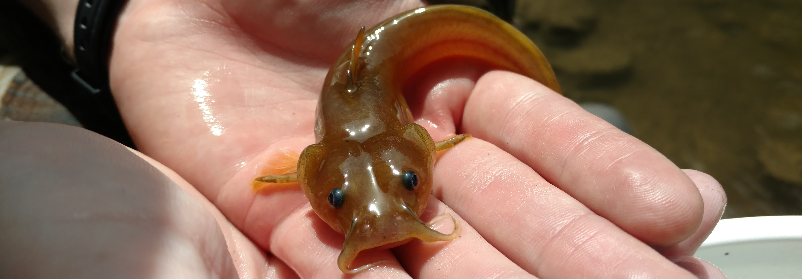

```{r, child="_styles.Rmd"}
```

<br>
 


<br>
 
This course covers subjects related to biology, evolution, ecology and conservation of fishes using fishes of New York to emphasize important concepts during the semester in field and lab experiences.The objective of this course is to help students construct a basic framework of knowledge that will provide a foundation for further learning about the biology, ecology, and management of fishes. In order to achieve this objective, students are introduced to concepts related to life-history strategies, taxonomy, and ecology of fishes in addition to important concepts in fisheries conservation and management.

<br>
 