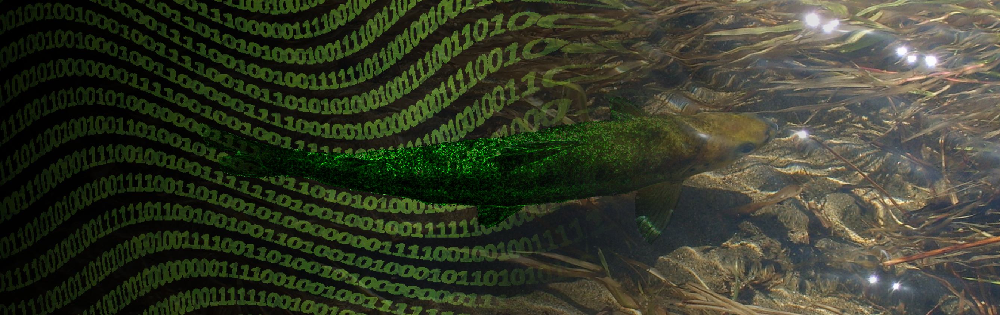

```{r, child="_styles.Rmd"}
```

<br>
 


<br>
 
### Looking for the <a href="classes/BIOL678/index.html"> course website </a>?

<br>
  
This course covers a wide range of topics in modern quantitative biology from descriptive statistics and probability distributions to inferential statistics and exploratory analyses. Topics covered vary based on need, but have included frequentist and Bayesian methods ranging from bivariate parametric and non-parametric hypothesis tests to linear models, general linear models, mixed models, non-standard regression tools, model selection and multi-model inference, multivariate analyses, and machine learning techniques. We explore underlying philosophies and applications associated with each of these tools through in-depth examples and relevant literature. Extensive work in `R` and other languages.

<br>
