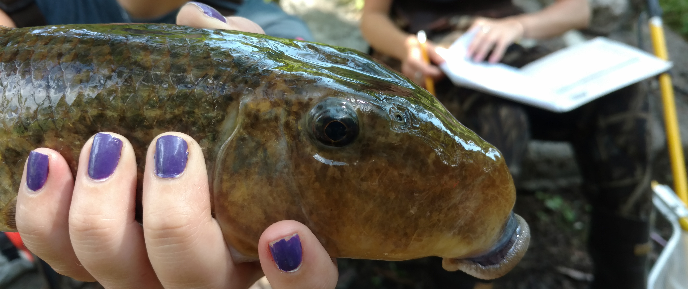

```{r, child="_styles.Rmd"}
```



The objective of this course is to help students build an advanced, contemporary body of knowledge related to biology, evolution, ecology, and conservation of fishes. In order to achieve this objective, students will be introduced to concepts related to life-history strategies, taxonomy, and ecology of fishes in addition to important concepts in fisheries conservation and management. Students will explore deeper into each of these aspects of ichthyology through analysis and evaluation of peer-reviewed literature, and technical communication of information to mixed audiences in addition to building breadth in taxonomic expertise through exposure to sampling techniques and fish diversity in the Northeast United States.
