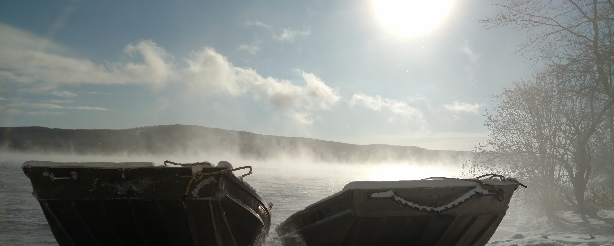

```{r, child="_styles.Rmd"}
```

<br>
 


<br>
 
Introduction to the science (and art) of lake management, and economic, social, and regulatory contexts within which management is practiced. Topics will include basic limnology and biology; necessary skills and techniques; stakeholder perceptions and interactions; regulatory considerations; management approaches and objectives; and the development, implementation and evaluation of management plans.

The purpose of this course is to help students construct a basic framework of knowledge that will provide a foundation for further learning about lake and reservoir management. Upon successful completion of this course, students will have developed i) technical skills and the capacity for problem-solving that are fundamental to conducting work on lakes and reservoirs, ii) an understanding of how to engage with stakeholders in a productive and professional manner, iii) a cognitive framework for thinking critically about common issues related to lake management, and iv) an understanding of how and why lake management plans are used, evaluated, and implemented.

<br>
 