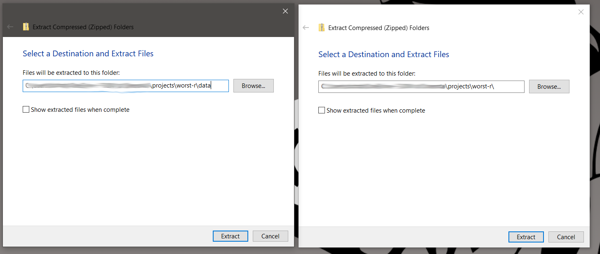
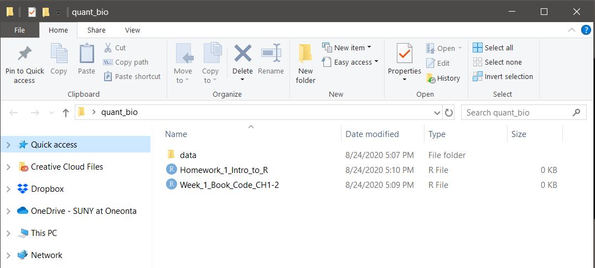

```{r, child="../../_styles.Rmd"}
```

# Getting started

----


<h2 id = "multi"><b>Software</b></h2>

All software required for this class is <b>freely available</b> and <b>easily installed</b>. Please download and install the most recent versions of each. Instructional videos and download links are provided below.


<h3 id = "multi"> Download and install R </h3>
For <a href=https://cran.r-project.org/bin/windows/base/> Windows </a> or <a href=https://cran.r-project.org/bin/macosx/> Mac </a>. You should download the most recent version of R for your operating system. Accept the default options.

<h3 id = "multi"> Download and install RStudio </h3>
<a href=https://www.rstudio.com/products/rstudio/download/#download> Rstudio download site</a>. You should download the most recent version. This program will not work without an existing installation of R. Also accept default installation options.

<h3 id = "multi"> Video instructions for installing R and RStudio </h3>
[3 minute YouTube video for Mac](https://www.youtube.com/watch?v=EmZqlcKkJMM)<br>
[3 minute YouTube video for Windows](https://www.youtube.com/watch?v=iLSvjyYvbpU)

<h3 id = "multi"> Download and Microsoft Teams </h3>
The desktop version will work best. The workshop will work best for you if you install Teams on the same computer as R so you can share code snippets and share screens in help channels. A web cam is not required but 

<h2 id="multi">**Data**</h2>

<h3 id = "multi">Download `data.zip`</h3>
Download the class data as a zip file called `data.zip` from <a href= https://github.com/danStich/worst-r/blob/master/data.zip>the github repository</a> for The Worst Stats Text eveR.

<h3 id = "multi">Put `data.zip` file your class folder</h3>
If you did not choose which folder to download this file to, it will be in your Downloads folder. Please copy and paste it to a folder just for class code and data. The actual name and location of this folder are not important as long as you can remember it.

<h3 id = "multi">Extract the zip file</h3>
Once `data.zip` is in a location you will remember, extract (or "unzip") it. 

On Mac, you should just need to double click `data.zip` to extract the contents.

On Windows, Right click > Extract All will bring up a context menu that looks like the image on the left below. Be sure to delete "data" from the final name before clicking "Extract" (shown on right). Otherwise your data will be inside a folder called data that's inside another folder called data and you'll have to copy and paste everything up one level.



Your class folder should look something like this when you are done (but you won't have any R files in there yet).



<br>
 