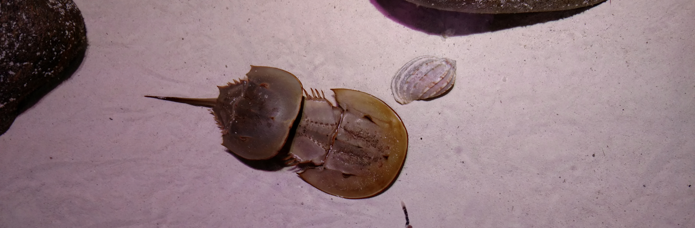

```{r child="../../_styles.Rmd"}
```

<h1 id="multi"> GLM: Count models </h1>



<h2 id="multi"> Introduction </h2>

This week we continue our exploration of generalized linear models and their implementation and interpretation in R. We will continue to investigate the flexible formulation of GLM for use with count models. By the end of this week, you should have a reasonable understanding of why we might use different kinds of count models, how to use them, and what the results mean. We will dive back into the world of residual diagnostics again this week to look at a few different tools that we have at our disposal for GLM.


## Poisson regression
Poisson regression is useful for situations in which we have a response that is a count. These are discrete data that cannot be considered continuous because it is impossible for them to take on non-integer or non-negative values. Common examples of these types of responses include species count data in ecology, cell counts in biology, and the number of respondents or patients reporting a side-effect or symptom of interest in the health care
profession.

For the Poisson family, the link function that we will use is the 'log' link function. This function allows us to work with data that are constrained to be non-negative, a desireable property when we are working with count data.

Let's use a crab data set to demonstrate the GLM with Poisson data, we will walk through this data set for both the Poisson and negative binomial examples, addressing some distributinal assumptions and model fit along the way.

```{r, echo=TRUE, eval=FALSE}
# Read in the data. These data also are available through
# the glm2 package in R.
  crabs = read.csv('crabs.csv', header = TRUE)

# Have a look-see
  head(crabs)
  str(crabs)
```

```{r, echo=FALSE}
# Read in the data. These data also are available through
# the glm2 package in R.
  crabs = read.csv('../../data/crabs.csv', header = TRUE)

# Have a look-see
  head(crabs)
  str(crabs)
```


### Data explanation
These data represent the number of satellite male crabs per female (rows) horseshoe crab in relation to a number of characteristics of the females, including their color, spine condition, carapace width, and mass (g).

The full citation for the paper on which this data set is based:

H. J. Brockmann. 1996. Satellite male groups in horseshoe crabs, *Limulus polyphemus*. Ethology 102:1-21. [doi:10.1111/j.1439-0310.1996.tb01099.x](https://onlinelibrary.wiley.com/doi/abs/10.1111/j.1439-0310.1996.tb01099.x)

```{r}
# We want to convert color to
# a factor right off the bat
  crabs$color = as.factor(crabs$color)

# Fit a model
  count.mod = glm(
    satellites~width+mass+spine+color,
    data=crabs,
    family='poisson'(link=log)
    )

# Right away, we can see that
# this model is not a very good fit to the data.
  par(mfrow=c(2,2))
  plot(count.mod)
  par(mfrow=c(1,1))
```

This brings us to the next important point we need to make about GLMS...

> Even though we are relaxing the assumptions of linear models, we still need to check to make sure the models we use are valid with respect to our assumptions.

This will become considerably more complicated as we begin to move into distributions other than the binomial and the Poisson, as our standard methods become less and less applicable and in-depth model validation becomes more and more obscure and more involved.

So, what is going on here? Well, we can see from the first plot that the variance changes with the mean. We can also see that there are some evident issues in our Q-Q plot WRT to the observed vs theoretical values. Finally, we can see that we have some serious outliers in the plot of residuals vs leverage. This is strongly indicative of a skewed distribution in this case given the spread of our leverage points. Outside of the Poisson and binomial (not the negative binomial!) distributions the interpretability of these plots deteriorates quickly, so we will look at a couple of other methods moving forward.

If we had started by doing data exploration we would have, of course, noticed that even though the data represent counts, they are pretty clearly overdispersed and are indicative of a negative binomial distribution.

For now, we won't bother to take a look at these results because the link function is the same, so we can get the results from the negative binomial regression in the same way.


## Negative binomial regression
Okay, moving on with life, let's take a look at the negative binomial regression model.

We will start this time by actually doing some data exploration before our analysis.

First, look at the distribution of the data. Here, it should be pretty obvious to you by now that these are count data for which the mean is not equal to the variance...right?
```{r}
hist(crabs$satellites)
```    

If you think back to a couple of weeks ago, you'll remember this is a pretty typical example of the negative binomial distribution

We can take a look at how this shakes out between our groups (color) as well
```{r}
boxplot(satellites~color, data=crabs)
```

And, you can see here that even within groups the distributions do not look like they have equal means and variances, so we will fit a GLM that assumes the response is drawn from a negative binomial distribution. We will need to load a package for this (yay!):

```{r, message=FALSE, warning=FALSE}
library(MASS)
```

For this example, we will use a function called `glm.nb`. This function lets us estimate parameters for a GLM that uses the negative binomial error distribution and estimates the "overdispersion parameter" for the negative binomial distribution. You, *of course*, remember this parameter and know it as `theta` from our discussions about probability distributions. Just in case you're having trouble remembering, take a look at the lecture module for <a href = "02_probabilityDistributions.html">probability distributions</a>.

```{r, eval=FALSE, message=FALSE, warning=FALSE}
?glm.nb
```

Let's start by fitting a model. Note that we do not need to specify the distributional family or the link function because the `glm.nb` function was created specifically for the case of negative binomial regression

```{r}
neg.mod = glm.nb(satellites~width+mass+color, data=crabs)
```

OR, we could fit it with the GLM function like this:
```{r, eval=FALSE}
neg.mod = glm(satellites~width+mass+color, data=crabs,
              family='negative.binomial'(theta = 1))
```

Play around with the two formulations above and see if there's a difference. *Clue*: there's not really. Just two different ways to do the same thing. The functionality in the `glm` function only came around recently, that's all.

Now, let's take a look at the distribution of the residuals.
```{r}
res = neg.mod$residuals
```


And, we can look at the output for the default diagnostic plots for `glm` objects in R as we have done in weeks past:
```{r, echo=FALSE}
par(mfrow=c(2,2))
plot(neg.mod)
par(mfrow=c(1,1))
```

Our residuals appear to also take on a negative binomial error distribution, but these plots are hard to interpret in the world of GLMs without a few tweaks...

Luckily, there is also a tool for this purpose:
```{r, message=FALSE, warning=FALSE}
# Load the boot package
  library(boot)

# Run the diagnostic plots for our model
  glm.diag.plots(neg.mod)
```

Here, we get a pretty clear picture that our model is adequately describing the overdispersion in the count data when we use the negative binomial distribution, but we may have some issues with extreme data points and excess zeroes.

**But**, how does this compare to the Poisson model for count data? We can use model selection to compare the Poisson model to the negative binomial model, since the response is the same in both cases.
```{r}
AIC(count.mod, neg.mod)
```

Clearly the negative binomial model is far superior to the Poisson model here. Now, with a good model in hand we could proceed with data visualization, `...`

Still, this will not be satisfying to the purists out there as the two models are not "nested" in the sense that one is a subset of the other. There are some philosophical issues with an I-T approach in this situation, in which case a full-on model validation test might be necessary to determine which model posesses the best predictive properties. Thinking back to our previous conversations, this process potentially could include some measure of accuracy and precision (like the root mean squared error) for each model based on cross validation methods or boot strapping.

But for now on with life again, and we can finally look at the model output.
```{r}  
summary(neg.mod)
```

The interpretation of this output is virtually identical to the output for linear models that we have been working with. Here, we see that no variable is significant with $\alpha$ 0.05, and that only the mass of females is marginally close to having a "significant" effect. How does this compare to the original findings? Go take a look.


## Zero inflation 

The fits of these two models, in reality, suggest the need to for what is becoming an increasingly common statistical tool: the zero inflated count model. Zero inflation (excess zeroes in count data) can arise by one of two mechanisms: true ("process") zeros and observational zeros that result from imperfect detection.

One approach to dealing with this is to use a **hurdle model**. The idea is to make two separate models: 1) a logistic regression model to help us determine which factors influence whether the phenomenon of interest even occurred (0 or 1), and 2) a count model to help us determine what factors influence with the frequency of occurrence given that it occurred in the first place.

First, we make a binary indicator variable to represent whether or not the phenomenon occurred:

```{r}
# Make a new column for presence
# and absence (of satellite males)
# and initialize to zero
crabs$present <- 0

# Assign a '1' if any satellites were
# observed
crabs$present[crabs$satellites >0] <- 1
```

Now, the first step in the hurdle model is to fit a logistic regression model to predict how our response is affected by some combination of explanatory variables.

```{r}
step1 = glm(present~mass, data=crabs, family='binomial')
summary(step1)
```  

Here we see that mass has a significant effect on whether or not *any* satellite males are present. You could imagine fitting any number of plausible biological models for comparison using AIC at this point.

Step 2 is to fit a count model to explain the effects of some combination of explanatory variables on the frequency with which the phenomenon occurs given that it ever occurred in the first place. **Note**: This does not have to be the same combination of explanatory variables. In fact, it is always conceivable that different processes influence these two distinct phenomena. As with the presence-absence model, you could even fit a candidate set of models and proceed with model comparisons using AIC.

```{r}
# Make a model relating the number
# of satellite males to the mass
# of female crabs
  step2 = glm.nb(
    satellites~mass,
    data=crabs[crabs$satellites!=0,]
    )

# Print a summary of the model
  summary(step2)
```

From these results, we can see that our count models in the previous sections were really just picking up on the large number of zeroes in our data set. We know this because of the differences in the results between the models `step1` and `step2`. 

Likewise, we can take another look at our model diagnostics for `step2` to see if our diagnostic plots look more reasonable now

```{r}
# Make diagnostic plots
  glm.diag.plots(step2)
```

Here, we can see that our residual plots indicate a pretty drastic improvement.

Of course, there are a number of built-in functions available from different packages that can be used to do the same thing that we've done above. Here is one example from the `pscl` package:

```{r, message=FALSE, warning=FALSE}
# Load the pscl package
  library(pscl)

# Fit a zero-inflated regression model
  neg.mod2 = zeroinfl(
    satellites~width+mass+color,
    data=crabs,
    dist='negbin'
    )
```

The output here is essentially the same as that from above. The advantage to this approach is that the routine is packaged in a single call, so the output is likewise collected into a single object.
