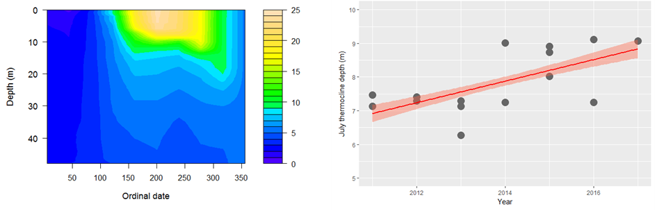

```{r child="_styles.Rmd"}
```

<h1 id="multi">Linear models </h1>



<h2 id="multi"> Introduction </h2>  

The objective of this assignment is to move beyond simple null hypothesis significance tests and get you thinking about how you can approach real-world problems mathematically. To do this, we will introduce a class of tools known as linear models. The simplest of these tools are the linear regression model, and the analysis of variance (ANOVA).  

In addition to introducing the concepts of linear models, we also will begin to build your statistical vocabulary and start using the kind of language that you see in peer-reviewed journal articles for framing the analysis in the methods section and reporting the results of statistical tests. We will ease into some of the more common vernacular this week and continue to develop this skill for the rest of the semester.  

By the end of this lab, you should be comfortable running and interpretting 1) parametric linear models (regression, ANOVA, ANCOVA), and 2) non-parametric alternatives to these models.  

## Exercises  
<h3 id="multi"> Analysis of variance (ANOVA) </h3>

We'll start this week with analysis of variance (ANOVA). ANOVA is an extension of the t-tests we worked with last week. Last week, we tested hypotheses about differences in the mean of some response between two groups. ANOVA let's us extend that to include cases in which we might want to test for differences in more than two groups. As we will see, this allows for comparisons not only between more than two groups (e.g. through one-way ANOVA), but also allows us to look across multiple grouping factors in a single test (e.g. two-way ANOVA).

We will use the simple case of the one-way ANOVA to practice our newly acquired skills in n-way ANOVA. Begin by reading in the smolt data from last week:  

```{r, eval=FALSE}
# Read in the smolt data
smolts <- read.csv('smolts.txt')

# Look at the first few lines for a sanity check
head(smolts)
```

```{r, echo=FALSE}
# Read in the smolt data
smolts <- read.csv('../../data/smolts.txt')

# Look at the first few lines for a sanity check
head(smolts)
```

*Reminder*: if you have forgotten what these data mean, they are described in
detail in the lab exercise from last week.

Use a one-way ANOVA to investigate differences in gill NKA activity among all stages of smolts in the dataset.  

**Question 1.** State the purpose of the analysis (i.e. to detect the effects of "blank" on "other blank"), and formally state the null hypothesis for this analysis.  

**Question 2.** Explain the results of the test in sentence format, being sure to include the test statistic, the numerator and denominator degrees of freedom, and the p-value along with the test that you used. Also report the R^2^ value for this model (recall you can get this multiple ways): see the <a href="04_LinearModels.html">lecture module</a> or the <a href="04_anova.html">ANOVA example</a> on the course website. You should be able to do this in 1-2 sentences. See the ANOVA example for help putting this into words, but give it your own flare.  

Now, use a Tukey HSD test to determine factor-level differences in gill NKA activity between presmolts, smolts, and postsmolts. After you run the test, make a boxplot of nka by stage to help visualize the results. Be sure to label your axes!  

*Reminder*: if you have forgotten how to conduct the Tukey HSD for pairwise comparisons of factor-level means, you can find this in the <a href="04_LinearModels.html">lecture module</a> for this week.

See also:

```{r, eval = FALSE}
?TukeyHSD
```

**Question 3.** Report the results of the Tukey test, being sure to include mean and sd for each factor level, in addition to p-values for tests of differences between factor levels. Use complete sentences. See the anova example on the course website for help.   

### Kruskal-Wallis rank sum test  

Now let's move on to the case in which we can't meet assumptions of normality in the residuals for our groups (assumption #2 from the <a href="04_LinearModels.html">lecture module</a>). Here, we need to use the Kruskal-Wallis test as a 'non-parametric' alternative. Recall that we fit this model using the `kruskal.test` function in R. We will use the same example that we used last week for the Wilcoxon test, smolt osmolality vs stage, but this time we will use all three stages: `Presmolt`, `Smolt`, and `Postsmolt` to examine differences in osmolality.

Remember that last week we showed the response variable, osmolality, was not normally distributed among these ontogenetic stages of smolt development: 

```{r, collapse=TRUE}
shapiro.test(smolts$osmolality[smolts$stage=='Smolt'])
shapiro.test(smolts$osmolality[smolts$stage=='Presmolt'])
shapiro.test(smolts$osmolality[smolts$stage=='Postsmolt'])
```

It actually is for Postsmolts, but we need the sampling distribution within each of these levels to be normal to meet the assumptions of ANOVA. This is  the same as saying that the residuals are normally distributed. We can look at those assumptions like this:

```{r, collapse=TRUE, hide=TRUE, eval=FALSE}
plot(lm(osmolality~stage, data=smolts))
```

I have omitted the plots here because we will discuss them in detail next week. But, if you run the code, you will see that the Q-Q plot shows a little bit of a weird pattern with a bend toward the middle of the line. Honestly, none  of these diagnostics would really preclude use of an ANOVA in this particular case, but let's continue with our example as though we are super conservative with the call.

So, we move on with a non-parametric analysis for now. Use what you learned this week to test the null hypothesis that there is no difference in osmolality between groups using the `kruskal.test` function, realizing that the alternative hypothesis for this test is that at least one mean is different from the others. 

**Question 4.** Did you reject the null hypothesis or fail to reject? State your answer in sentence form, and be sure to report the test statistic, degrees of freedom, and p-value in your answer.  

**Question 5.** Which levels are different from one another? Can you tell from this test alone? How could you find out which levels differ?  

```{r, eval=FALSE}
install.packages('PMCMR')
```

```{r, collapse=TRUE, message=FALSE, warning=FALSE}
# Here's one option: 
library(PMCMR)

# WORST NAME EVER FOR A FUNCTION!!!!
posthoc.kruskal.nemenyi.test(osmolality~stage, data=smolts, dist='Chisquare')
```

There are actually a whole bunch of different functions in the `PMCMR` package with which we conduct post-hoc tests to do pair-wise comparisons. The function above compares the response for each one of our grouping values, while correcting for inflated Type-I error rates.  

**Question 6.** So now which stages differ in the response, `osmolality` according to the Kruskal-Nemenyi test above? Show a visual representation of these differences using either a boxplot or a violin plot. See <a href="04_violinPlotsInR.html">this</a> example from the course website for help. on the course website if you want to try violin plots, and use the example from the `caroline` package because it is easier. Please note that before you can use the function you will need to install and load the package (may not be able to on campus computers).  

```{r, eval=FALSE}
# install.packages('caroline')
library(caroline)
```

### Linear regression

Moving on...Now let's move on to the case for which we have a continuous response variable *and* a continuous explanatory variable. What are we supposed to do here? Everything we have talked about to this point has been focused on detecting differences in continous responses between groups. Thank goodness for linear regression!! 

Remember, to use linear regression in R, we are still going to work with the `lm` function **because ANOVA and linear regression are the same thing here**, and they are both *linear models* of the form: $Y_i = \beta_0 + \beta_i*X_i + \varepsilon_i$ for which we are (for now) assuming that $\varepsilon_i$ is normally distributed with $\mu = 0$ and $\sigma^2 = 1$.  

Let's look at the relationship between gill NKA activity and plasma osmolality of the fish used in this study. Use the `lm` function to test the effects of gill nka on plasma osmolality following exposure to salt water.  

**Question 7.** **i)** Is there a significant effect of gill NKA activity on plasma osmolality following exposure to saltwater? Remember, you need to use the `summary` function to answer this question. **ii)** What is the direction of this relationship (positive or negative), and what response in plasma osmolality would you expect to see with increasing gill NKA activity?  

**Question 8.** How much of the variability in plasma osmolality does gill NKA activity explain (think R^2^)?  

### ANCOVA

Putting it all together now. Let us imagine a world in which we are not only interested in the effects of categorical OR continuous variables on our response, but rather the *additive* or *combined* effects of these variables on our response. Now we're talking about useful stuff! To do this we will use the analysis of covariance (ANCOVA). 

Remember, to use ANCOVA in R, we are still going to work with the `lm` function **because ANOVA and linear regression and ANCOVA are the same thing here**, and they are ALL *linear models* of the form: $Y_i = \beta_0 + \beta_i*X_i + \varepsilon_i$ in which we are (for now) assuming that $\varepsilon_i$ is normally distributed with $\mu = 0$ and $\sigma^2 = 1$.

> Awesome sauce.  

With the `lm` function in R, use ANCOVA to test the *additive* effects of stage and gill NKA activity on plasma osmolality.  

Now look at the results. **Remember** there are two different methods we need to use to understand the results of the ANCOVA because now we have both groups and continuous explanatory variables. Remember that the `summary` function gives us the regression coefficients and an overall R^2^ for the model, and the `Anova` function will give us the anova table for the model that we can use to determine whether or not `stage` had a significant effect overall, but we need to specify the argument `type = 'III'` in the call. In order to use the `Anova` function, you will need to install and load the `car` library:  

```{r, eval=FALSE}
# Install package
# install.packages('car')

# Load it
library(car)

# Check out the Anova function
?Anova
```

**Question 9.** What can you conclude about the effects of `stage` and `nka` on osmolality? Report this in sentence format as you did above, this time being sure to include the test name, test statistic, p-value, R^2^ for the model. This may need a few sentences because we now have to report the results of the ANOVA-style component of the analysis.  

**Question 10.** Describe how osmolality varied between stages (reporting mean and sd of osmolality for each stage in addition to differences between levels). Then, describe how osmolality changed with gill NKA activity in addition to stage (be sure to indicate the direction of the relationship using your regression coefficients).  

 