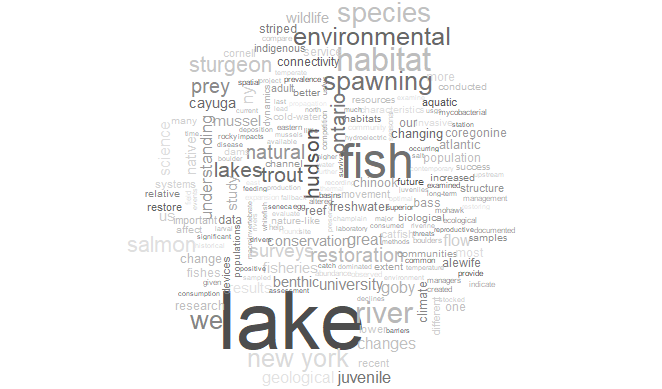

```{r, child="../../_styles.Rmd"}

```

<h2 id="multi">
  NY Chapter American Fisheries Society Virtual R Workshop Website
</h2>



Welcome to the **TEST** website for virtual R workshops hosted by the <a href="">New York Chapter American Fisheries Society</a>. This site is intended to serve as a permanent link to course content so members and attendees can access online learning modules, data sets, and code used for workshops wherever or whenever they are. Workshop modules can be accessed through the <a href="content.html">Workshop modules</a> page. All modules are self-contained and will include necessary datasets. For help getting started with R, please check out the <a href="software.html">Software</a> and <a href="">Additional Resources</a> tabs.
